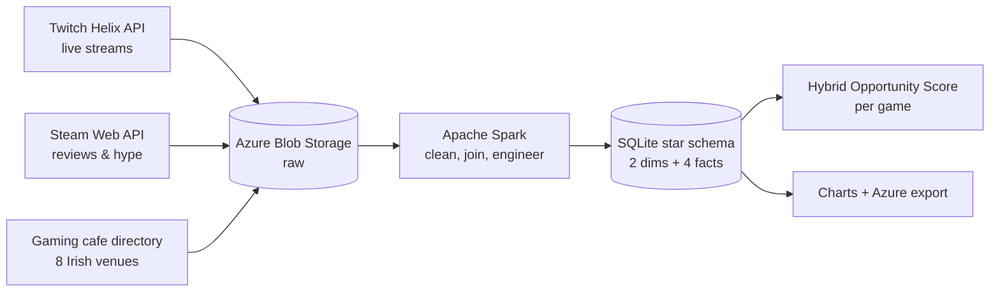
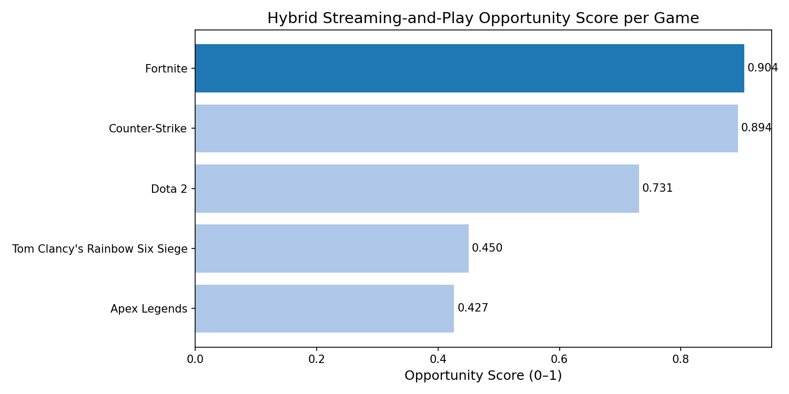
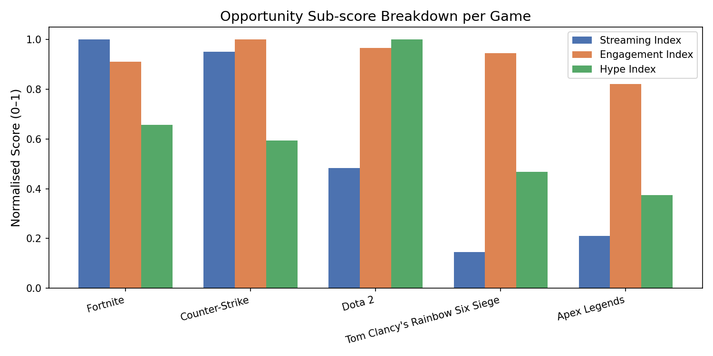

# 🎮 Hybrid Esports Hub Analytics Pipeline

**Which esports title — and which Irish city — makes the strongest case for a gaming cafe to go all-in on streaming setups? Answered with a real cloud data pipeline instead of forum opinions.**

Twitch + Steam APIs → Azure Blob Storage → Apache Spark → a proper star-schema database → a single number a business could actually act on.

---

## The Pipeline



1. **Ingest** — live Twitch stream data (viewer counts, stream metadata) for 5 major esports titles, Steam review/sentiment data, and a curated list of 8 real gaming cafes across 6 Irish cities. Everything lands in Azure Blob Storage as CSV.
2. **Process** — PySpark reads the raw blobs, cleans and joins them, and writes a proper star schema: `dim_game`, `dim_cafe` (dimensions) + `fact_streaming_metrics`, `fact_review_engagement`, `fact_hype_metrics`, `fact_opportunity_scores` (facts) into SQLite.
3. **Score** — each game gets a weighted **Hybrid Opportunity Score** blending normalized streaming popularity, review engagement, and hype.
4. **Export** — final tables and charts are written back to Azure Blob and to `reports/`.

## Results (from the actual populated database)

| Game | Streaming | Engagement | Hype | **Opportunity Score** |
|---|---|---|---|---|
| **Fortnite** | 1.000 | 0.910 | 0.656 | **0.904** |
| Counter-Strike | 0.951 | 1.000 | 0.594 | 0.894 |
| Dota 2 | 0.482 | 0.966 | 1.000 | 0.731 |
| Apex Legends | 0.211 | 0.821 | 0.375 | 0.427 |
| Tom Clancy's Rainbow Six Siege | 0.146 | 0.945 | 0.469 | 0.450 |

**Fortnite edges out Counter-Strike, 0.904 vs. 0.894** — closer than the usual esports-coverage airtime would suggest, and driven almost entirely by Fortnite's stronger live-streaming pull rather than review engagement (where Counter-Strike actually scores higher).

Cross-referencing against the 8-cafe directory adds a location angle: **Waterford and Galway each have exactly one gaming cafe**, while **Dublin has two** with the highest combined capacity — a visible gap between where streaming demand for these titles is highest and where dedicated venues actually exist.




## Tech Stack

| Layer | Tools |
|---|---|
| Ingestion | Twitch Helix API (OAuth), Steam Web API, `requests` |
| Cloud storage | Azure Blob Storage (`azure-storage-blob`) |
| Processing | Apache Spark (PySpark) — schema casting, joins, window functions |
| Warehouse | SQLite (star schema: 2 dimension + 4 fact tables) |
| Visualization | Matplotlib |

## Project Structure

```
Hybrid-Esports-Analytics-Pipeline/
├── notebooks/
│   ├── 01_data_ingestion_and_blob_upload.ipynb      # Twitch + Steam + cafe data → Azure Blob
│   ├── 02_spark_processing_and_db_loading.ipynb     # PySpark cleaning/joins → SQLite star schema
│   ├── 03_followup_analysis_and_visualisation.ipynb # Charts from the warehouse
│   └── 04_pipeline_execution_and_exports.ipynb      # End-to-end run + export to Azure/CSV
├── run_pipeline.bat                # Runs all 4 notebooks in order via nbconvert
├── data/
│   ├── hybrid_esports.db            # Populated star-schema database (ready to query as-is)
│   ├── raw/                          # One representative ingestion run (Twitch/Steam/cafes)
│   └── local_staging/                # Cafe directory + upcoming games reference data
├── reports/
│   ├── fig1-4_*.png                  # Generated charts
│   ├── architecture.png              # Pipeline architecture diagram
│   └── exports/                      # Final dim/fact tables as CSV
├── config/                           # Blob container layout + project settings (no secrets)
└── .env.example                      # Copy to .env and fill in your own API keys
```

## Running It

```bash
pip install -r requirements.txt
cp .env.example .env   # fill in TWITCH_CLIENT_ID/SECRET and AZURE_STORAGE_CONNECTION_STRING
```

Run the full pipeline end-to-end:
```
run_pipeline.bat
```
or step through each notebook manually in order (01 → 02 → 03 → 04). A Twitch developer account (free) and an Azure Storage account are required to re-run ingestion; the populated `data/hybrid_esports.db` and `reports/` let you explore the results without either.

## Known Limitations

- The Hybrid Opportunity Score is a simple weighted blend of three normalized metrics, not a validated business model — it's a first-pass ranking signal, not a guaranteed ROI predictor.
- Only 5 titles and 8 cafes are covered, reflecting API rate limits and the scope of a coursework timeline rather than a production-scale market study.

---

## Author

Built by [Saurabh Mastud](https://github.com/SaurabhMastud).
